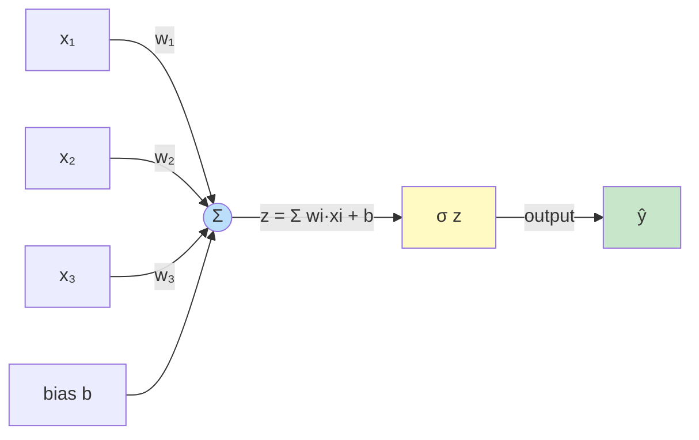
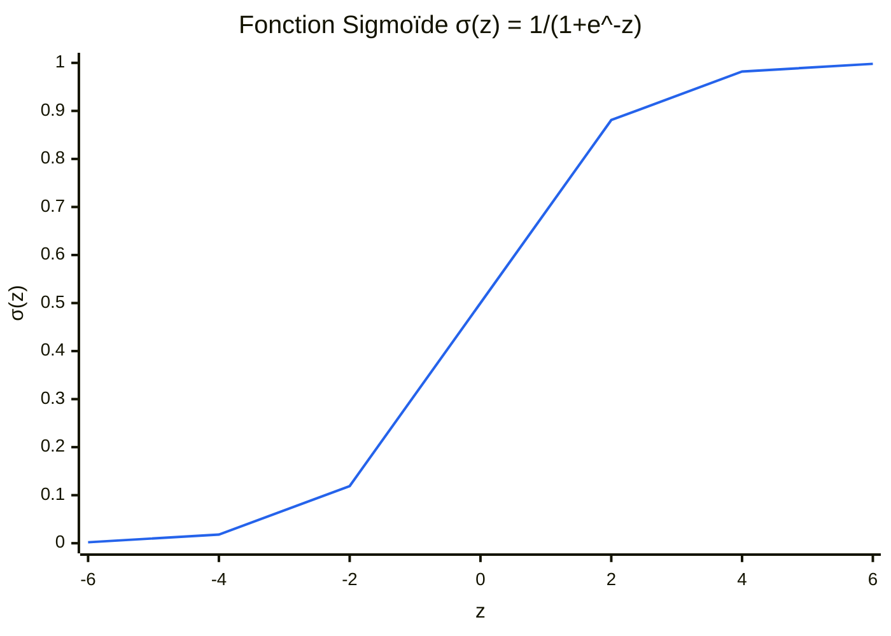
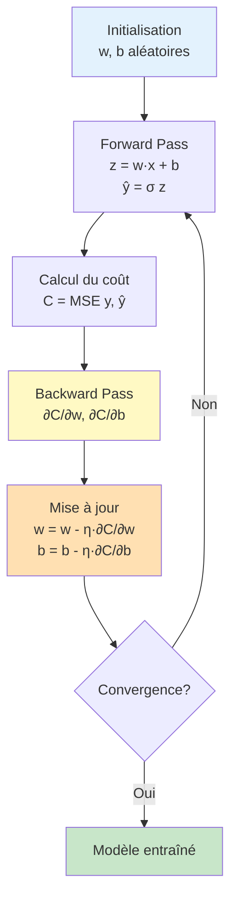

# 🧠 Neurone Artificiel - Implémentation Python

## 📋 Table des matières
- [Introduction](#introduction)
- [Architecture du neurone](#architecture-du-neurone)
- [Principes mathématiques](#principes-mathématiques)
- [Fonction d'activation : Sigmoïde](#fonction-dactivation--sigmoïde)
- [Descente de gradient](#descente-de-gradient)
- [Fonction de coût : MSE](#fonction-de-coût--mse)
- [Rétropropagation](#rétropropagation)
- [Utilisation](#utilisation)
- [Paramètres d'entraînement](#paramètres-dentraînement)
- [Exemple : Porte logique OR](#exemple--porte-logique-or)

---

## 🎯 Introduction

Ce projet implémente un **neurone artificiel simple** (perceptron) capable d'apprendre par **descente de gradient**. Il démontre les concepts fondamentaux du deep learning :
- Fonction d'activation (sigmoïde)
- Fonction de coût (MSE)
- Rétropropagation
- Optimisation par descente de gradient

---

## 🏗️ Architecture du neurone

### Schéma du neurone

#### Diagramme Mermaid



#### Représentation ASCII détaillée

```
      x₁ ──────┐
               │ w₁
      x₂ ──────┼───► z = Σ wi·xi + b ──► σ(z) ──► output
               │ w₂
      x₃ ──────┘
               ↓
              bias (b)
```

### Composants

1. **Entrées (x)** : Vecteur d'entrée de dimension n
2. **Poids (w)** : Vecteur de poids de dimension n
3. **Biais (b)** : Scalaire ajouté à la somme pondérée
4. **Fonction d'activation (σ)** : Sigmoïde transformant z en output

### Équation du neurone

```
z = w₁x₁ + w₂x₂ + ... + wₙxₙ + b = w·x + b
output = σ(z) = 1 / (1 + e⁻ᶻ)
```

---

## 📐 Principes mathématiques

### 1. Somme pondérée

La **somme pondérée** combine les entrées avec leurs poids respectifs :

```
z = Σ(wᵢ × xᵢ) + b = w·x + b
```

**Interprétation** : Chaque poids wᵢ indique l'importance de l'entrée xᵢ.

---

## 🌊 Fonction d'activation : Sigmoïde

### Définition

```
σ(z) = 1 / (1 + e⁻ᶻ)
```

### Propriétés

- **Domaine** : ℝ (tous les réels)
- **Image** : (0, 1) 
- **Forme** : Courbe en S (sigmoïde = "en forme de S")
- **Point d'inflexion** : z = 0, σ(0) = 0.5

### Graphique

#### Visualisation avec Mermaid



#### Représentation ASCII (pour terminaux)

```
σ(z)
  1 ┤        ╭───────
    │      ╱
0.5 ┤    ╱
    │  ╱
  0 ┤╱─────────────────
    └─┴─┴─┴─┴─┴─┴─┴─┴─► z
   -4 -2 0  2  4
```

#### Graphique haute résolution

Pour une visualisation parfaite, utilisez le script Python fourni :
```python
python neurone.py  # Affiche les graphiques matplotlib
```

**Ou créez le graphique manuellement :**
```python
import numpy as np
import matplotlib.pyplot as plt

z = np.linspace(-6, 6, 100)
sigmoid = 1 / (1 + np.exp(-z))
sigmoid_deriv = sigmoid * (1 - sigmoid)

plt.figure(figsize=(10, 6))
plt.plot(z, sigmoid, 'b-', linewidth=2, label='σ(z)')
plt.plot(z, sigmoid_deriv, 'r--', linewidth=2, label="σ'(z)")
plt.grid(True, alpha=0.3)
plt.xlabel('z', fontsize=12)
plt.ylabel('Valeur', fontsize=12)
plt.title('Fonction Sigmoïde et sa Dérivée', fontsize=14, fontweight='bold')
plt.legend(fontsize=12)
plt.axhline(y=0.5, color='gray', linestyle=':', alpha=0.5)
plt.axvline(x=0, color='gray', linestyle=':', alpha=0.5)
plt.show()
```

### Dérivée de la sigmoïde

**Formule remarquable** :
```
σ'(z) = σ(z) × (1 - σ(z))
```

**Preuve** :
```
σ(z) = 1 / (1 + e⁻ᶻ)

σ'(z) = d/dz [1 / (1 + e⁻ᶻ)]
      = -1 / (1 + e⁻ᶻ)² × (-e⁻ᶻ)
      = e⁻ᶻ / (1 + e⁻ᶻ)²
      = 1/(1 + e⁻ᶻ) × e⁻ᶻ/(1 + e⁻ᶻ)
      = σ(z) × (1 - σ(z))
```

**Propriétés importantes** :
- Maximum en z = 0 : σ'(0) = 0.25
- Tend vers 0 quand |z| → ∞
- **Cette dérivée est cruciale pour la rétropropagation !**

### Graphiques haute résolution

Pour générer des graphiques haute qualité :

```bash
python generate_readme_plots.py
```

Cela créera des images PNG dans le dossier `images/` :

#### Fonction Sigmoïde et sa dérivée


*Ce graphique montre la fonction d'activation sigmoïde et sa dérivée, cruciale pour la rétropropagation.*

---

## ⬇️ Descente de gradient

### Principe

La **descente de gradient** est un algorithme d'optimisation qui minimise la fonction de coût en ajustant itérativement les paramètres dans la direction opposée au gradient.

### Visualisation

#### Diagramme de la descente de gradient



#### Représentation ASCII

```
Fonction de coût C(w)
      ↑
      │     Initial
      │       ●
      │      ↙ ↘
      │    ●    ●
      │   ↙      ↘
      │  ●        ●
      │ ↙          ↘
      │●    Minimum  ●
      └──────────────────► w
```

### Règle de mise à jour

```
w_nouveau = w_ancien - η × ∂C/∂w
b_nouveau = b_ancien - η × ∂C/∂b
```

Où :
- **η (eta)** = learning rate (taux d'apprentissage)
- **∂C/∂w** = gradient de la fonction de coût par rapport à w
- **∂C/∂b** = gradient de la fonction de coût par rapport à b

### Effet du learning rate

#### Visualisation graphique


*Ce graphique compare l'impact de différentes valeurs de learning rate sur la convergence.*

#### Représentation ASCII

```
Learning rate trop petit (η = 0.01)
C │     ●
  │      ● Convergence lente
  │       ●
  │        ●
  │         ●
  └──────────────────► itérations

Learning rate optimal (η = 0.5)
C │     ●
  │       ●●
  │          ●● Convergence rapide
  │              ●
  └──────────────────► itérations

Learning rate trop grand (η = 5.0)
C │   ●     ●
  │      ●     ● Divergence/oscillations
  │   ●     ●
  │      ●
  └──────────────────► itérations
```

---

## 📉 Fonction de coût : MSE

### Mean Squared Error (Erreur Quadratique Moyenne)

```
MSE = (1/n) × Σ(yᵢ - ŷᵢ)²
```

Où :
- **n** = nombre d'exemples
- **yᵢ** = valeur cible (target)
- **ŷᵢ** = valeur prédite (output du neurone)

### Pourquoi MSE ?

1. **Pénalise fortement** les grandes erreurs (grâce au carré)
2. **Toujours positive** (erreur au carré)
3. **Dérivable partout** (essentiel pour le gradient)
4. **Convexe** pour les réseaux linéaires

### Visualisation

```
MSE
  ↑
  │     ╱│╲
  │    ╱ │ ╲
  │   ╱  │  ╲
  │  ╱   │   ╲
  │ ╱    │    ╲
  │╱_____│_____╲____
  └──────┴──────────► Paramètres
         Minimum
         (optimal)
```

---

## 🔄 Rétropropagation

### Principe

La **rétropropagation** (backpropagation) calcule le gradient de la fonction de coût par rapport à chaque paramètre en appliquant la **règle de la chaîne**.

### Chaîne de calcul

```
Entrée (x) → Somme pondérée (z) → Activation (σ) → Sortie (ŷ) → Coût (C)
             ↑                     ↑                  ↑            ↑
             w, b                  σ(z)              output      MSE
```

### Calcul des gradients par la règle de la chaîne

Pour un exemple (x, y) :

#### 1. Gradient par rapport à la sortie

```
∂C/∂ŷ = ∂/∂ŷ [(y - ŷ)²/2] = -(y - ŷ) = -error
```

#### 2. Gradient par rapport à z (avant activation)

```
∂C/∂z = ∂C/∂ŷ × ∂ŷ/∂z
      = -error × σ'(z)
      = -error × σ(z) × (1 - σ(z))
      = -error × output × (1 - output)
```

**C'est ici qu'intervient la dérivée de la sigmoïde !**

On définit : **δ = ∂C/∂z = -error × σ'(output)**

#### 3. Gradient par rapport aux poids

```
∂C/∂wᵢ = ∂C/∂z × ∂z/∂wᵢ
       = δ × xᵢ
```

Car z = w·x + b, donc ∂z/∂wᵢ = xᵢ

#### 4. Gradient par rapport au biais

```
∂C/∂b = ∂C/∂z × ∂z/∂b
      = δ × 1
      = δ
```

Car ∂z/∂b = 1

### Schéma complet de la rétropropagation

#### Diagramme détaillé


*Ce diagramme montre le flux de calcul du forward pass et du backward pass avec tous les gradients.*

#### Schéma ASCII simplifié

```
Forward Pass (Propagation avant) :
x → [w·x + b] → [σ(z)] → output → [MSE] → C

Backward Pass (Rétropropagation) :
        ∂C/∂w ← δ×x
                 ↑
x → z → output → δ = -error × σ'(output)
                 ↑
        ∂C/∂b ← δ
```

### Algorithme de mise à jour (pour un batch)

```
1. Pour chaque exemple (xᵢ, yᵢ) dans le batch :
   a. Forward pass : calculer output = σ(w·xᵢ + b)
   b. Calculer error = yᵢ - output
   c. Calculer δ = error × σ'(output)
   d. Accumuler ∂C/∂w += δ × xᵢ
   e. Accumuler ∂C/∂b += δ

2. Moyenner les gradients : diviser par n (taille du batch)

3. Mettre à jour les paramètres :
   w = w + η × moyenne(∂C/∂w)
   b = b + η × moyenne(∂C/∂b)
```

**Note** : Le signe + vient du fait que δ contient déjà le signe négatif de l'erreur.

---

## 💻 Utilisation

### Installation

```bash
pip install numpy matplotlib
```

### Exécution

```bash
python neurone.py
```

### Interface interactive

Le programme vous demandera :

1. **Nombre d'époques** (par défaut : 15000)
   ```
   Entrez le nombre d'époques (par défaut 15000) : 10000
   ```

2. **Learning rate** (par défaut : 0.5)
   ```
   Entrez le learning rate (par défaut 0.5) : 0.3
   ```

---

## ⚙️ Paramètres d'entraînement

### 1. Nombre d'époques

Une **époque** = un passage complet sur tout le dataset.

**Recommandations** :
- Problème simple (OR, AND) : 5000-15000 époques
- Problème complexe : 50000+ époques

**Signes de convergence** :
- ✅ Erreur diminue puis se stabilise
- ❌ Erreur oscille → réduire le learning rate
- ❌ Erreur augmente → réduire fortement le learning rate

### 2. Learning rate (η)

**Valeurs typiques** :
- Très petit : 0.01 - 0.1 (convergence lente mais stable)
- Optimal : 0.3 - 0.7 (pour ce neurone simple)
- Grand : 1.0 - 2.0 (risque d'oscillations)
- Trop grand : > 5.0 (divergence probable)

**Stratégie d'ajustement** :

```
Si divergence (erreur augmente) :
  → Diviser le learning rate par 10

Si convergence trop lente :
  → Multiplier le learning rate par 2

Si oscillations :
  → Diviser le learning rate par 2
```

### 3. Initialisation des poids

Les poids et biais sont initialisés **aléatoirement** entre 0 et 1.

**Pourquoi aléatoire ?**
- Évite la symétrie (tous les neurones feraient la même chose)
- Brise les patterns réguliers
- Permet l'exploration de différents minima

---

## 🔧 Exemple : Porte logique OR

### Table de vérité

| x₁ | x₂ | y (OR) |
|----|----|--------|
| 0  | 0  | 0      |
| 0  | 1  | 1      |
| 1  | 0  | 1      |
| 1  | 1  | 1      |

### Représentation graphique

```
  x₂
   ↑
 1 │ 1     1
   │
 0 │ 0     1
   └─────────→ x₁
     0     1
```

### Interprétation géométrique

Le neurone apprend une **frontière de décision** (ligne) qui sépare les classes :

#### Visualisation de l'apprentissage


*Ce graphique montre comment le neurone apprend à séparer les classes avant et après l'entraînement.*

#### Représentation ASCII

```
  x₂
   ↑
 1 │ ●     ●  (classe 1)
   │   ╱
   │ ╱  Frontière
 0 │○────────  (classe 0)
   └─────────→ x₁
     0     1

Équation de la frontière : w₁x₁ + w₂x₂ + b = 0
```

### Poids appris typiques

Après entraînement, le neurone converge vers des poids similaires à :
```
w₁ ≈ 5-7
w₂ ≈ 5-7
b ≈ -2 à -3
```

**Interprétation** :
- Poids positifs élevés : chaque entrée à 1 pousse fortement vers la sortie 1
- Biais négatif : compense pour que (0,0) donne une sortie proche de 0

### Résultats attendus

```
Configuration:
  - Époques: 15000
  - Learning rate: 0.5

PRÉDICTIONS
Entrée: [0 0], Sortie: 0.0234, Sortie binaire: 0, Cible: 0 ✓
Entrée: [0 1], Sortie: 0.9876, Sortie binaire: 1, Cible: 1 ✓
Entrée: [1 0], Sortie: 0.9812, Sortie binaire: 1, Cible: 1 ✓
Entrée: [1 1], Sortie: 0.9998, Sortie binaire: 1, Cible: 1 ✓

Coût MSE final: 0.000123
```

---

## 📊 Visualisations

Le programme génère **4 graphiques** :

### 1. Évolution de l'erreur moyenne
Montre la convergence de l'apprentissage.

### 2. Évolution des poids
Montre comment chaque poids évolue au fil du temps.

### 3. Évolution du biais
Montre l'ajustement du biais.

### 4. Erreur en échelle logarithmique
Permet de mieux voir la convergence exponentielle.

---

## 🎓 Concepts clés à retenir

1. **Neurone = Transformation linéaire + Activation non-linéaire**
   ```
   output = σ(w·x + b)
   ```

2. **Apprentissage = Minimisation d'une fonction de coût**
   ```
   min C(w, b) via descente de gradient
   ```

3. **Gradient = Direction de plus forte croissance**
   ```
   On va dans la direction opposée pour minimiser
   ```

4. **Rétropropagation = Règle de la chaîne appliquée**
   ```
   Calcul efficace de ∂C/∂w et ∂C/∂b
   ```

5. **Dérivée de sigmoïde = Clé de la rétropropagation**
   ```
   σ'(z) = σ(z) × (1 - σ(z))
   ```

---

## 📚 Pour aller plus loin

### Limitations de ce neurone simple

- ❌ Ne peut apprendre que des fonctions **linéairement séparables**
- ❌ Ne peut pas résoudre le XOR
- ❌ Pas de couches cachées

### Extensions possibles

1. **Multi-Layer Perceptron (MLP)** : Ajouter des couches cachées
2. **Autres fonctions d'activation** : ReLU, tanh, softmax
3. **Régularisation** : L1, L2, Dropout
4. **Optimiseurs avancés** : Adam, RMSprop, SGD avec momentum
5. **Batch normalization** : Normaliser les activations

---

## 📖 Références

- Rosenblatt, F. (1958). The Perceptron: A Probabilistic Model for Information Storage
- Rumelhart, Hinton & Williams (1986). Learning representations by back-propagating errors
- Nielsen, M. (2015). Neural Networks and Deep Learning

---

## 👨‍💻 Auteur

Implémentation pédagogique d'un neurone artificiel avec descente de gradient par batch.

**Date** : Octobre 2025

---

## 📄 Licence

Ce code est fourni à des fins éducatives.